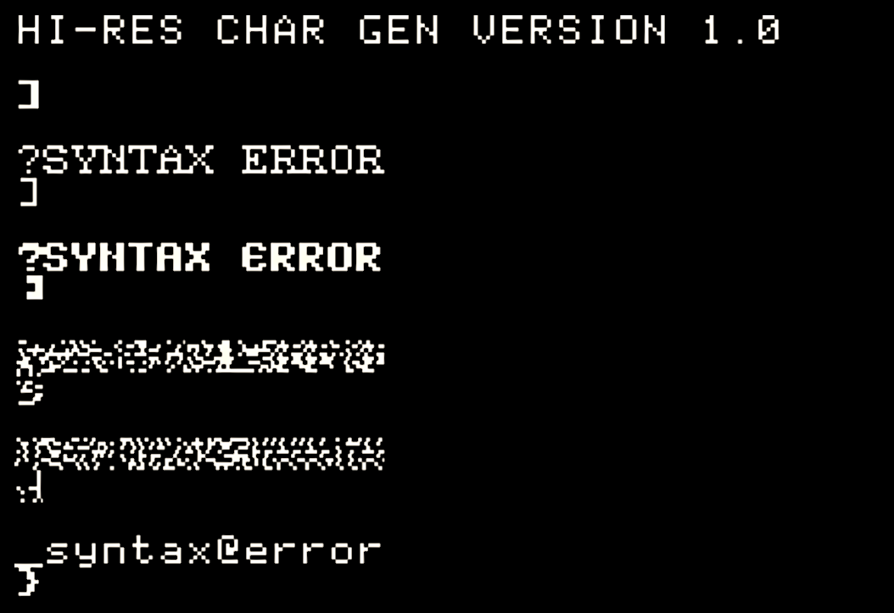

# HRCG teardown

([GitHub project page]({{ site.github.repository_url }}))

This is my attempt to disassemble some of the routines on the DOS Toolkit disk, also known as the Applesoft Tool Kit. Don Lancaster's *Tearing Into Machine Language Code* suggests disassembling the Apple Hi-Res Character Generator (HRGC), and I started with its building blocks, the relocatable module loaders.

So far I've disassembled:

- [RBOOT](RBOOT.html) -- loads and relocates RLOAD.
- [RLOAD](RLOAD.html) -- loads and relocates HRCG, APA or other relocatable module.

And mostly finished:

- [HRCG](HRCG.code.html) -- Hi-Res Character Generator. The disassembly is of the HRCG code itself. The header (code length) and footer (relocatable table entries) are normally generated by EDASM.

Afterward I found Dr John B Matthews had already done an [analysis of RBOOT/RLOAD for ProDOS](https://sites.google.com/site/drjohnbmatthews/apple2/rel). Mine was just for fun anyway, but since the DOS 3.3 version has a lot of differences, it might be useful.

RBOOT/RLOAD for DOS are described in `applesoft_toolkit__part_2_.pdf` (chapter 4) on Asimov.
HRCG is mostly described in part 1 (chapter 2).

## Bugs

HRCG doesn't bounds check (or keep track of) the number of alternate charsets you loaded. If you select a charset number (`^A n`) out of range, you will get garbage.

Below I loaded 2 alternate charsets (`ROMAN.SET` and `FLOW.SET`) and then pressed `^A 1 <ENTER>` to select alternate 1, `^A 2 <ENTER>` ... `^A 5 <ENTER>`. Charsets 3 and 4 are garbage -- actually HRCG program code at `HRCG +$0000` and `HRCG +$0300`, since the charsets are loaded directly below it. Charset 5 is, surprisingly, legible. That's because charset 5 lands at `HRCG +$0600`, and the builtin charset stretches from `+$0500 .. +$07FF`. The offset of `$0100` into the font effectively shifts uppercase to lowercase, including symbols. 

